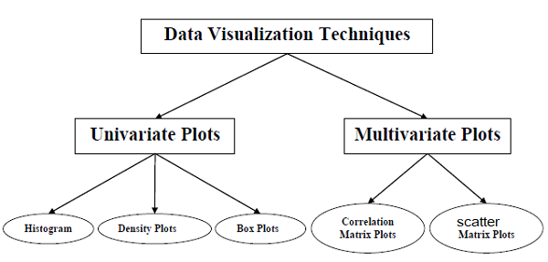
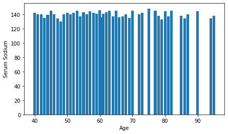
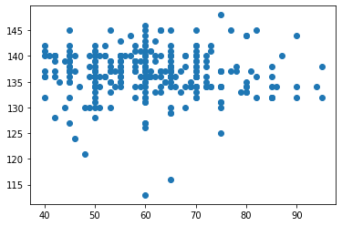
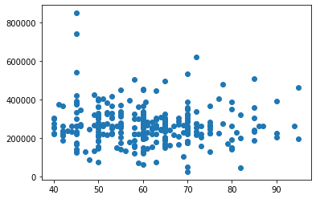
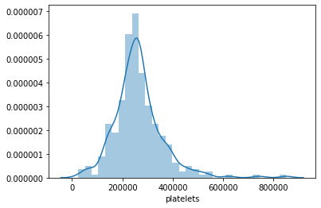
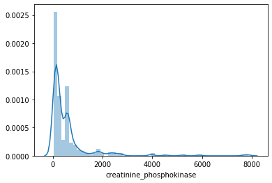
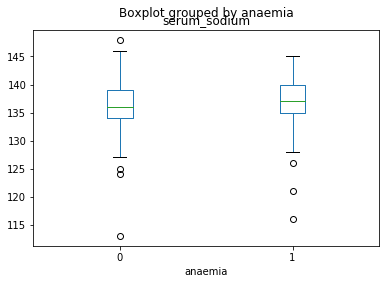
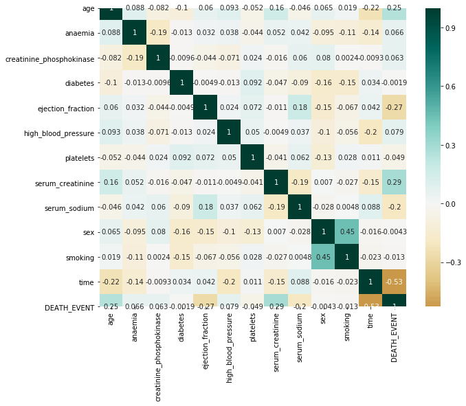

## What is Data Visualization?

It is a technique of representing the data in the forms of graphics so that it can easily be interpreted.
As a human, we all know that we are good at understanding graphics rather than understanding thousands of line of statistics.
Data Visualization can be especially useful when one is trying to explore the data and getting acquainted with it. Also since a picture is worth a thousand words, then plots and graphs can be very effective in conveying a clear description of the data especially when disclosing findings to an audience or sharing the data with other peer data  scientists. 

**Data Visualization** is used mainly in the field of **Machine Learning and Data Science**.
Today no matter which field you are working on, *Data Visualization* is very important in analzing the **raw data** to identify **trends, patterns**, and **outliers** within large data sets. 
Data visualization helps the data scientist explore the data, understand the data and process the data to set it up for modeling.

Since the machine learning process is iterative, asking relevant questions to kick off the process will involve putting data into context.

Putting data into context means that you will visualize all the columns within the data to understand the following:
* The meaning of each column of data.
* Whether it’s a categorical or continuous variable for each column.
* Whether the data is an independent or dependent variable.

Using the dataset of [***Heart attack possibility***](https://github.com/Avikr76/Open-contributions/blob/master/extras/heart_failure_clinical_records_dataset.csv), below is an example of visualizing some column of our dataset

 ### Visualization using Bar Chart
 A bar chart is a very popular visualization tool. a bar chart also known as a bar graph is a type of plot where the length of each bar is proportional to the value of the item that it represents.
 

### Visualizing using Scatter Plot

A scatter plot is a type of plot that displays values pertaining to typically two variables against each other. Usually it is a dependent variable to be plotted against an independent variable in order to determine if any correlation between the two variables exists.

### Visualizing using Histogram

A histogram is a way of representing the frequency distribution of a numeric dataset. The way it works is it partitions the spread of the numeric data into bins, assigns each datapoint in the dataset to a bin, and then counts the number of datapoints that have been assigned to each bin.So the vertical axis is actually the frequency or the number of datapoints in each bin.

### Visualizing using Box Plot
Box plot is a way of statistically representing the distribution of given data through five main dimensions. The first dimension is minimum, which is the smallest number in the sorted data. The second dimension is first quartile, which is the point 25% of the way through the sorted data. In other words, a quarter of the datapoints are less than this value. The third dimension is median, which is the median of the sorted data. The fourth dimension is third quartile, which is the point 75% of the way through the sorted data. In other words, three-quarters of the data points are less than this value. And the final dimension is maximum, which is the highest number in the sorted data.

### Where are the possible data errors, such as missing data, wrong data types, misleading data, and outlier data, and so on?

Missing data is a well-recognized problem in large datasets. This lack of standardization is one of the leading causes of the subtle problem of disguised missing data, in which unknown, inapplicable, or otherwise nonspecified responses are encoded as valid data values. The consequences of disguised missing data can be quite serious. Bad data results in bad results.
The data must be cleaned before using it in training model to correct and identify all the errors. So we get correct results.

Below is an example of a nullity matrix that gives you missing data information visually on columns of data:

***The high density represents the high data errors like misleading data, missing data etc.***
It is visualized by the Python's **Heatmap**.It gives the degree of missing data.

### Where are the imbalances of data?

Below is an example of using a heatmap to represent the correlation of the relationships between the variables.

Following 5 methods for dealing with imbalances of data
1. Change the performance metric
2. Change the algorithm
3. Oversample minority class
4. Undersample majority class
5. Generate synthetic samples

Heatmap is just  a grid of divided into small squares which has a different shades of color for easier interpretation of data.
The larger the number and darker the color the higher the correlation between the two variables and vice versa.

### Data visualization can power model creation and model tuning

With the advancement of data visualization techniques, model creation and model tuning do not have to be abstract processes means  Instead of dealing with the details of implementing algorithms, or figuring out proper ways to hitch the output of one function to the input of another, the developer can focus on the overall logic of the application with the help of **TensorFlow** . 
**TensorFlow** allows you to follow the model-creation process with data visualization.

Tuning is an important part of modeling. Unlike parameters that derive their value from training, the values of hyperparameters are defined before the learning process begins. These hyperparameters control the behavior of the algorithms and have an impact on the performance of the model. Concerns of hyperparameters, such as trainability, tunability, and robustness, determine the usability of the models.
### Conclusions
Data visualization is the discipline of trying to understand data by placing it in a visual context so that patterns, trends and correlations that might not otherwise be detected can be exposed.
With different tools in python such as **seaborn, scikit-learn, and matplotlib**, helps in visualizing data easily and efficiently.

