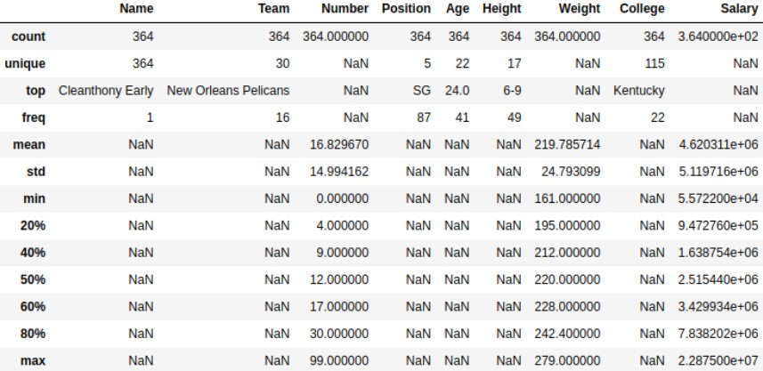
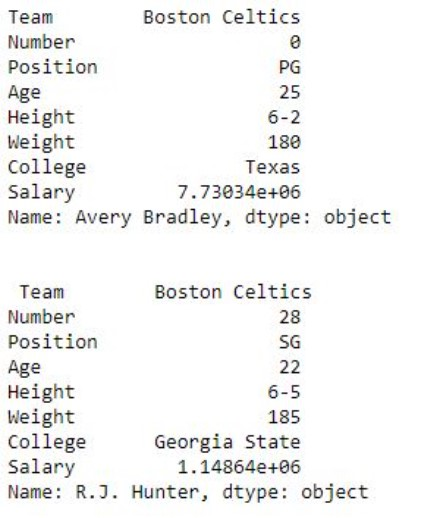
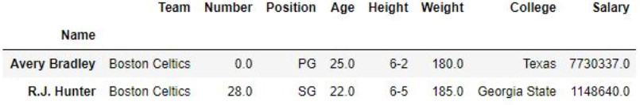
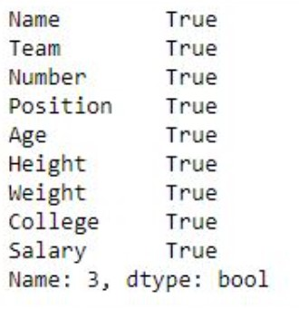

# Functions & Methods
The important Functions & Methods used in Pandas are:
* head()
* describe()
* loc[]
* iloc[]
* read_csv()

### Dataframe/Series.head() method
Pandas head() method is used to return top n (5 by default) rows of a data frame or series.<br>
**Syntax:** Dataframe.head(n=5)<br>
**Parameters:** n: integer value, number of rows to be returned<br>
**Return type:** Dataframe with top n rows<br>

In the following examples, the data frame used contains data of some NBA players. The image of data frame before any operations is attached below.


**Example #1:** In this example, top 5 rows of data frame are returned and stored in a new variable. No parameter is passed to .head() method since by default it is 5.
```python
# importing pandas module 
import pandas as pd 
  
# making data frame 
data = pd.read_csv("https://media.geeksforgeeks.org/wp-content/uploads/nba.csv") 
  
# calling head() method  
# storing in new variable 
data_top = data.head() 
  
# display 
data_top 
```

**Output**


**Example #2:** In this example, the .head() method is called on series with custom input of n parameter to return top 9 rows of the series.
```python
# importing pandas module 
import pandas as pd 
  
# making data frame 
data = pd.read_csv("https://media.geeksforgeeks.org/wp-content/uploads/nba.csv") 
  
# number of rows to return 
n = 9
  
# creating series 
series = data["Name"] 
  
# returning top n rows 
top = series.head(n = n) 
  
# display 
top 
```

**Output**


### Dataframe/Series.describe() method
Pandas describe() is used to view some basic statistical details like percentile, mean, std etc. of a data frame or a series of numeric values. When this method is applied to a series of string, it returns a different output which is shown in the examples below.<br>
**Syntax:** DataFrame.describe(percentiles=None, include=None, exclude=None)<br>
**Parameters:** <br>
percentile: list like data type of numbers between 0-1 to return the respective percentile<br>
include: List of data types to be included while describing dataframe. Default is None<br>
exclude: List of data types to be Excluded while describing dataframe. Default is None<br>
**Return type:** Statistical summary of data frame.<br>

**Example #1:** In this example, the data frame is described and [‘object’] is passed to include parameter to see description of object series. [.20, .40, .60, .80] is passed to percentile parameter to view the respective percentile of Numeric series.
```python
# importing pandas module  
import pandas as pd  
  
# importing regex module 
import re 
    
# making data frame  
data = pd.read_csv("https://media.geeksforgeeks.org/wp-content/uploads/nba.csv")  
    
# removing null values to avoid errors  
data.dropna(inplace = True)  
  
# percentile list 
perc =[.20, .40, .60, .80] 
  
# list of dtypes to include 
include =['object', 'float', 'int'] 
  
# calling describe method 
desc = data.describe(percentiles = perc, include = include) 
  
# display 
desc 
```

**Output**



**Example #2:** In this example, the describe method is used on Series of strings called by the Name column to see the behaviour with object data type.
```python
# importing pandas module  
import pandas as pd  
  
# importing regex module 
import re 
    
# making data frame  
data = pd.read_csv("https://media.geeksforgeeks.org/wp-content/uploads/nba.csv")  
    
# removing null values to avoid errors  
data.dropna(inplace = True)  
  
# calling describe method 
desc = data["Name"].describe() 
  
# display 
desc 
```

**Output**


### Dataframe/Series.loc[] method
Pandas provide a unique method to retrieve rows from a Data frame. DataFrame.loc[] method is a method that takes only index labels and returns row or dataframe if the index label exists in the caller data frame.<br>
**Syntax:** pandas.DataFrame.loc[]<br>
**Parameters:** <br>
Index label: String or list of string of index label of rows<br>
**Return type:** Data frame or Series depending on parameters<br>

**Example #1:** In this example, Name column is made as the index column and then two single rows are extracted one by one in the form of series using index label of rows.
```python
# importing pandas package 
import pandas as pd 
  
# making data frame from csv file 
data = pd.read_csv("nba.csv", index_col ="Name") 
  
# retrieving row by loc method 
first = data.loc["Avery Bradley"] 
second = data.loc["R.J. Hunter"] 
  
print(first, "\n\n\n", second) 
``` 

**Output**



**Example #2:** In this example, Name column is made as the index column and then two single rows are extracted at the same time by passing a list as parameter.
```python
# importing pandas package 
import pandas as pd 
  
# making data frame from csv file 
data = pd.read_csv("nba.csv", index_col ="Name") 
  
# retrieving rows by loc method 
rows = data.loc[["Avery Bradley", "R.J. Hunter"]] 
  
# checking data type of rows 
print(type(rows)) 
  
# display 
rows 
```

**Output**



### Dataframe/Series.iloc[] method
Pandas provide a unique method to retrieve rows from a Data frame. Dataframe.iloc[] method is used when the index label of a data frame is something other than numeric series of 0, 1, 2, 3….n or in case the user doesn’t know the index label. Rows can be extracted using an imaginary index position which isn’t visible in the data frame.<br>
**Syntax:** pandas.DataFrame.iloc[]<br>
**Parameters:** <br>
Index Position: Index position of rows in integer or list of integer.<br>
**Return type:** Data frame or Series depending on parameters<br>

**Example #1:** In this example, same index number row is extracted by both .iloc[] and.loc[] method and compared. Since the index column by default is numeric, hence the index label will also be integers.
```python
# importing pandas package 
import pandas as pd 
  
# making data frame from csv file  
data = pd.read_csv("nba.csv") 
  
# retrieving rows by loc method  
row1 = data.loc[3] 
  
# retrieving rows by iloc method 
row2 = data.iloc[3] 
  
# checking if values are equal 
row1 == row2 
```

**Output**



**Example #2:** In this example, multiple rows are extracted first by passing a list and then by passing integers to extract rows between that range. After that, both the values are compared.
```python
# importing pandas package 
import pandas as pd 
  
# making data frame from csv file  
data = pd.read_csv("nba.csv") 
  
# retrieving rows by loc method  
row1 = data.iloc[[4, 5, 6, 7]] 
  
# retrieving rows by loc method  
row2 = data.iloc[4:8] 
  
# comparing values 
row1 == row2 
```

**Output**


### Pandas.read_csv() method
**read_csv** is an important pandas function to read csv files and do operations on it.<br>

**Example #1:** In this example, we're using pandas to read csv files.
```python
# Import pandas 
import pandas as pd 
  
# reading csv file  
pd.read_csv("filename.csv") 
```

Opening a CSV file through this is easy. But there are many others thing one can do through this function only to change the returned object completely. For instance, one can read a csv file not only locally, but from a URL through read_csv or one can choose what columns needed to export so that we don’t have to edit the array later.<br>
Here is the list of parameters it takes with their **Default values**.

|   **Parameter**    |                            **Use**                                      |
|--------------------|-------------------------------------------------------------------------|
| filepath_or_buffer | URL or Dir location of file                                             |
| sep                | Stands for seperator, default is ‘, ‘ as in csv(comma seperated values) |
| index_col          | Makes passed column as index instead of 0, 1, 2, 3…r                    |
| header             | Makes passed row/s[int/int list] as header                              |
| use_cols           | Only uses the passed col[string list] to make data frame                |
| squeeze            | If true and only one column is passed, returns pandas series            |
| skiprows           | Skips passed rows in new data frame                                     |

