# Line Graph
### A Line plot can be defined as a graph that displays data as points or check marks above a number line, showing the frequency of each value.
#### **Steps we follow to draw this graph:**

1. First, we define the x-axis and the y-axis values as lists.
2. Using .plot() we plot the graph
3. If we want , we can name the x-axis and the y-axis.
4. We can also give a title to our graph.
5. We use .show() to view our grap


```python
#import the Respeted libraries 
import matplotlib.pyplot as plt
from matplotlib import colors
from matplotlib.ticker import PercentFormatter
import numpy as np
import random as random
```

### Creating a Figure Containing Single Axes


```python
fig,points = plt.subplots()
points.plot([1, 4, 9, 13],[1,11,2,16])
```


    [<matplotlib.lines.Line2D at 0x1b9d0aef130>]


    

    


```python
#Creating a Figure Containing 2 axes
#Example1:
x = np.array([1, 3, 6, 9])  # X-axis points
y = np.array([1,6,3,9])
plt.plot(x, y,linestyle = 'dashed',linewidth=2,color = 'black')
#we can use many Line-styles, colors and adjust the thickness
plt.show() 
```


    
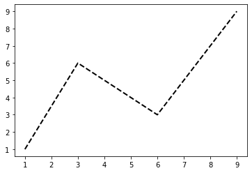
    


```python
#Example2
x = np.array(['Maths','Science','Social','English'])
y = np.array([50,60,40,90])
  
plt.plot(x, y)
plt.xlabel("Subjects",size='20')  # add X-axis label
plt.ylabel("Marks",size='20')  # add Y-axis label
plt.title("The Graph of Marks",size='18',color='blue')  # add title
plt.show()
```


    
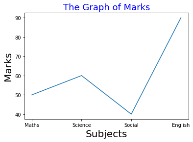
    


# Two or more lines on same graph


```python
#Example1
x = np.linspace(1,10,500)
fig, ax= plt.subplots()
ax.plot(x,x,label ='linear')
ax.plot(x,x**2,label ='quadratic')
ax.plot(x,x**3,label ='cubic')  
ax.set_xlabel("X-axis data")
ax.set_ylabel("Y-axis data")
ax.set_title('Multiple plots')
plt.legend()
```


    <matplotlib.legend.Legend at 0x1b9d0f28880>


    
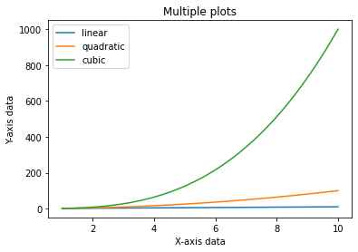
    


```python
#Example2
x = np.linspace(1,4,6)

fig, ax= plt.subplots()
ax.plot(x,x,label ='linear')
ax.plot(x,x**2,label ='quadratic')
ax.plot(x,x**3,label ='cubic')  
ax.set_xlabel("X-axis data")
ax.set_ylabel("Y-axis data")
ax.set_title('Multiple plots')
plt.legend()
```


    <matplotlib.legend.Legend at 0x1b9d10320d0>


    
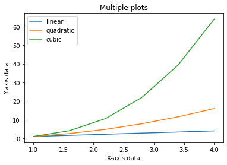
    


```python
#Example3
d=[5,10,15]
f=[10,20,30]
plt.plot(d,f,label ='Data1')
d1=[5,10,15]
f1=[15,40,10]
plt.plot(d1,f1,label ='Data2')
plt.xlabel("X-axis data")
plt.ylabel("Y-axis data")
plt.title('Two Lines on one Graph')
plt.legend()
```


    <matplotlib.legend.Legend at 0x1b9d0ff5cd0>


    
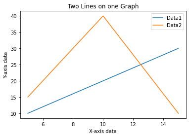
    


```python
#Example3
#The student names are added to the student’s list and the marks list is created at the random.randint() method.
students = ["Jane","Joe","Beck","Tom",
            "Sam","Eva","Samuel","Jack",
            "Dana","Ester","Carla"] 
marks=[]
for i in range(0,len(students)):
     marks.append(random.randint(0, 101))
  
plt.xlabel("Students",size=20)
plt.ylabel("Marks",size=20)
plt.title("CLASS RECORDS",size=22,color='blue')
plt.plot(students,marks,'m--')
```


    [<matplotlib.lines.Line2D at 0x1b9d241cd90>]


    
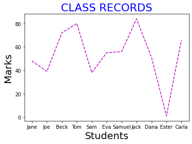
    


# Bar Chart
### A bar plot or bar chart is a graph that represents the category of data with rectangular bars with lengths and heights that is proportional to the values which they represent. The bar plots can be plotted horizontally or vertically. 
**To draw bar charts we use, plt.bar() function.**
#### matplotlib.pyplot.bar(x, height, width=0.8, bottom=None, *, align=’center’, data=None, **kwargs)

### The bars are at position x.
* Height refers to the height of the bars.
* We can pass the same height for all the bars , or , pass a list of different heights for each bars.
* **'align'** is the alignment of the bars with the x-axis.
* **'center'**: Center the base on the x positions.
* **'edge'**: Align the left edges of the bars with the x positions.
* We can add colours to the face of the bars as well as to the edges of the bars.
* We can give linewidth of the bar.
* If we put the linewidth to be 0 , then their won't be any bar edge.
* We can provide tick_labels.
* The default value of bottom is 0.


```python
#Example1
x = [15,39,23,6,43]
y = [27,48,69,32,0]

plt.bar(x,y,color='Blue')

plt.show()

```


    
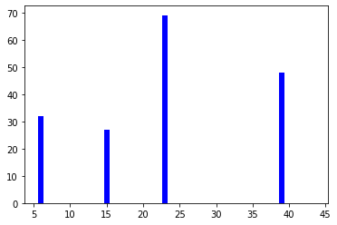
    


```python
#Example2
x = [5,2,3,6,9]

y = [27,48,69,32,100]

plt.bar(x,y,color='green')

plt.show()
```


    
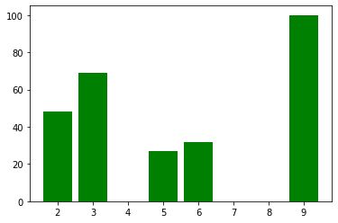
    


```python
x = [1, 2, 3, 4, 5]

h = [10, 24, 36, 40, 5]

tick_label = ['one', 'two', 'three', 'four', 'five']


plt.bar(x, h, tick_label = tick_label, width = 0.6, color = ['blue', 'red'])


plt.xlabel('x-axis')


plt.ylabel('y-axis')


plt.show()
```


    
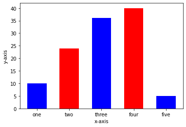
    


### Stacked bar plot
**Stacked bar plots represent different groups on top of one another. The height of the bar depends on the resulting height of the combination of the results of the groups.**


```python
#Example3
N = 5
 
boys = (20, 35, 30, 35, 27)
girls = (25, 32, 34, 20, 25)
boyStd = (2, 3, 4, 1, 2)
girlStd = (3, 5, 2, 3, 3)
ind = np.arange(N)  
width = 0.35 
 
fig = plt.subplots(figsize =(10, 7))
p1 = plt.bar(ind, boys, width, yerr = boyStd)
p2 = plt.bar(ind, girls, width,
             bottom = boys, yerr = girlStd)
 
plt.ylabel('Contribution',size='18',color='blue')
plt.xlabel('Teams Name',size='18',color='blue')
plt.title('Contribution by the teams',color='black',size='20')
plt.xticks(ind, ('T1', 'T2', 'T3', 'T4', 'T5'))
plt.yticks(np.arange(0, 81, 10))
plt.legend((p1[0], p2[0]), ('boys', 'girls'))
 
plt.show()
```


    
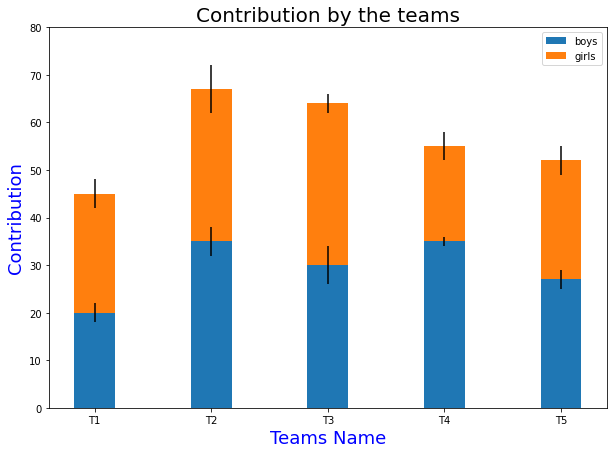
    


### Draw a horizontal bar chart
#### Creating a horizontal bar chart
##### Approach:

* Creating list y   for discrete values on y-axis
* Creating list x  consisting only numeric data for discrete values on x-axis
* Calling plt.barh() function with parameters y,x as plt.barh(y,x)
* Setting x_label() and y_label()
* Setting title() for our bar chart
* Calling plt.show() for visualizing our chart


```python
#Example1
f, ax = plt.subplots(figsize=(10,5))
x=['DataScience', 'Web-Devlopment', 'Machine Learning', 'Artificial intelligence']
y=[40, 24,67, 66] 
plt.barh(x, y,color='#ffa600')
plt.xlabel("Employees",size='18') 
plt.ylabel("Job Roles",size='18')   
plt.title("Horizontal bar graph",color = 'blue',size='22')
plt.show()
```


    

    


# Histogram
### A histogram is basically used to represent data provided in a form of some groups.It is accurate method for the graphical representation of numerical data distribution. It is a type of bar plot where X-axis represents the bin ranges while Y-axis gives information about frequency
##### matplotlib.pyplot.hist(x, bins=None, range=None, density=False, weights=None, cumulative=False, bottom=None, histtype=’bar’, align=’mid’, orientation=’vertical’, rwidth=None, log=False, color=None, label=None, stacked=False, data=None, kwargs)
* x: it takes an array or a sequence if array.
* bins : bins defines the number of equal width bins in the the given range.
* range:The lower and upper range of the bins.
* density: It is a boolean value , and its default is False. If it is True,it draws and returns a probability density.
* weights: array-like or None, default: None


```python
#Example1
y = [27,48,69,32,0]

plt.hist(y)


plt.show()
```


    
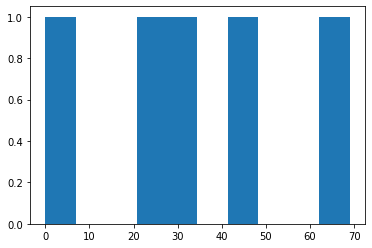
    


```python
#Example2
np.random.seed(23685752)
N_points = 10000
n_bins = 20
  
x = np.random.randn(N_points)
y = .8 ** x + np.random.randn(10000) + 25
fig, axs = plt.subplots(1, 1,
    figsize =(12, 7),tight_layout = True)
  
axs.hist(x, bins = n_bins)
  
plt.show()
```


    
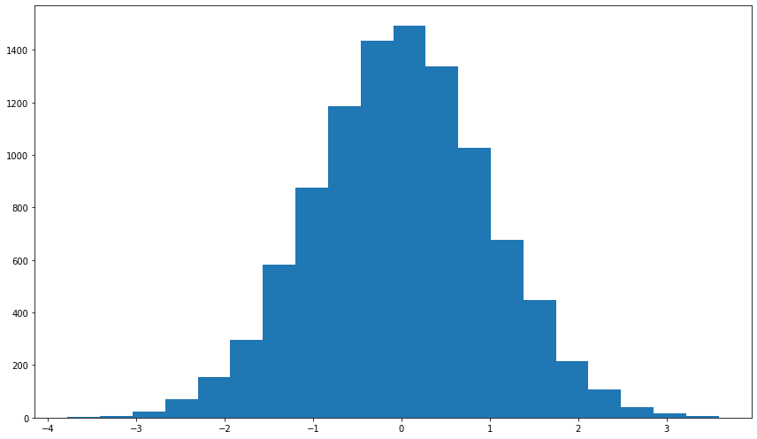
    


```python
#Example4
x = np.random.normal(170, 10, 250)

plt.hist(x)
plt.show() 
```


    
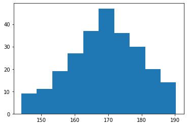
    

